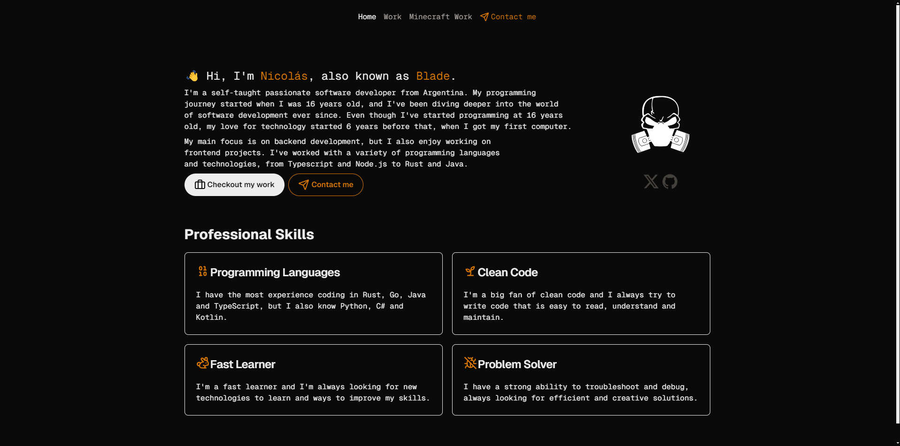

    
    

# bl4d3.dev

Personal portfolio and website, built using [Next.js](https://nextjs.org/).

## Development

1. Install dependencies with `pnpm install`.
2. Run the development server with `pnpm dev`.

## License

The content inside this repository is licensed by different licenses:

- The source code is licensed by the [MIT](LICENSE) license.
- The website logo is licensed under [CC-BY-SA-4.0](https://creativecommons.org/licenses/by-sa/4.0/).
- Other images, like those used in the work page for example, might not be my own and full credits go to their respective owners, unless otherwise noted.
